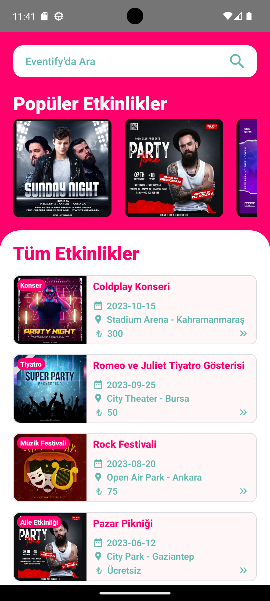
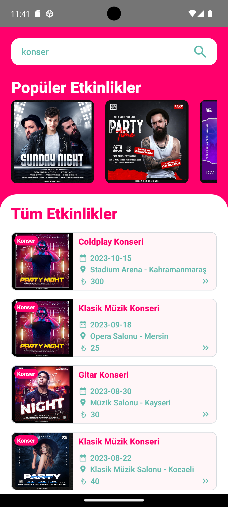
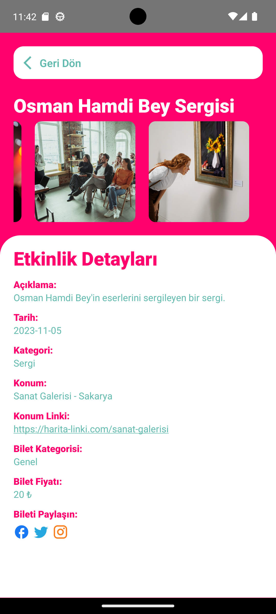
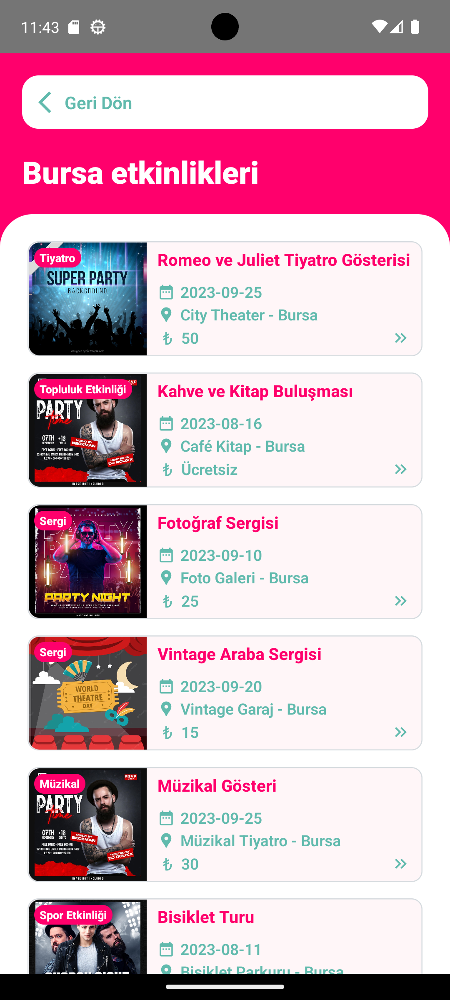

This is a [React Native](https://reactnative.dev/) project for TechCareer Bootcamp.

# Eventify Project

**Eventify** is an event management application through which users can view available concerts, theaters, exhibitions and other events, access detailed information, and easily navigate between these events and find the ones that suit their preferences. This README file is designed to explain the basic features and usage of the Eventify project.

## Project Description

Eventify offers users the following features:

- View events: Users can review available events through the app.
- Event details: Users can access detailed information for each event, including the event's category, description, date, venue and ticket price.
- Filtering: Users can filter events by type, venue and city, so they can easily find the most suitable event for them.
- Category: Each event has a category, so users can focus on a specific category.
- Image gallery: On the event detail page, pictures of the event are displayed with a slider.
- Search: The app can be searched by event name, type, venue and city.
- Venue-specific events: When you click on the name of a venue or city on Event Detail page, all events taking place at that venue or city are listed.
- Popular events slide: There is a slide with popular events on the homepage.
- Pricing: Some events are free of charge, while others may require a ticket. For ticketed events, different ticket fees may apply according to ticket categories.
- Social media sharing: On the event detail page, you can share the event on popular social media platforms.

## Installation

Follow the steps below to run Eventify in your local development environment:

1. Clone the repo: `git clone https://github.com/Rhaelkan/Eventify-TechCareer-React-Native`

2. Install the required dependencies: `npm install` or `yarn install`

3. Start the application: `npm start` or `yarn start`

## Contact

If you have any questions or suggestions, please feel free to contact me. My e-mail address is: hakandoruk2k@gmail.com

I hope you like it. 🎉

## ScreenShots

#### Home Screen:

#### Filtered Category on Search Bar:

#### Event Detail Screen:

#### Filtered City Events Screen:
